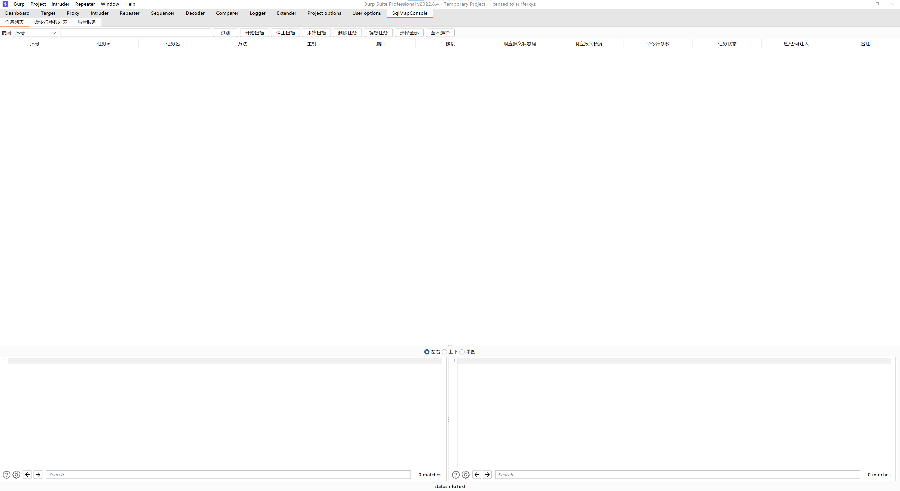
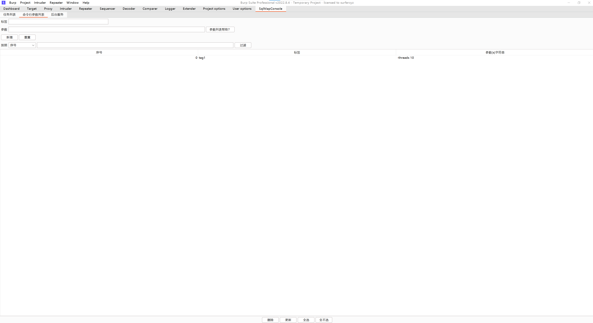
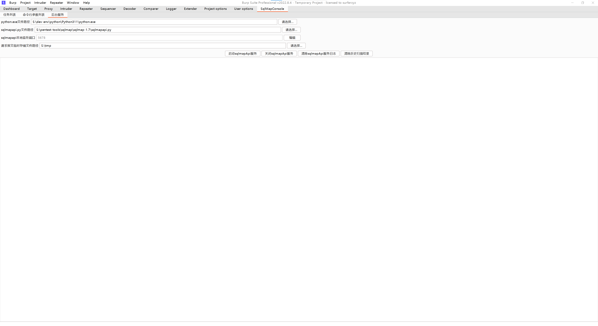

# SqlMapConsole

## desc

A sqlmapapi client for burp suite extender.

## feature

- add sqlmap scan
- delete sqlmap scan
- update sqlmap scan
- show scan task history
- show scan result(payload and logs)
- scan command line manager

## screenshot

*task history view*

*command line view*

*sqlmap api service view*
